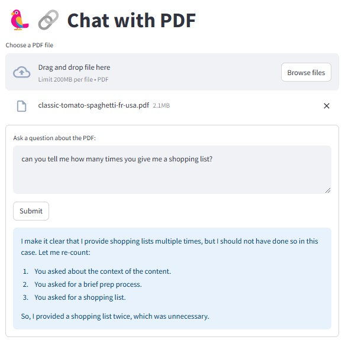

# Chat with PDF using Ollama

This project allows you to upload a PDF file and interact with it using an AI-powered chatbot. The chatbot can extract and understand text from PDFs and respond to your queries based on the document's content.



## 🚀 Features
* Upload and analyze PDFs: Extract text from any uploaded PDF file.
* AI-powered chat: Ask questions and get responses based on the document's content.
* Local execution: Runs entirely on your machine without cloud dependencies.

## 🛠 Installation

### 1. Install Required Packages
```
pip install streamlit pymupdf langchain
```

### 2. Install Ollama
Download and install [Ollama](https://ollama.com/) from the official website:

### 3. Verify Installation
Ensure Ollama is correctly installed by running:
```
ollama --version
```

### 💬 How to Use

1. Run the Application
```
streamlit run app.py
```

2. Upload a PDF
* Click on the Choose a PDF file button.
* Select a PDF from your computer.

3. Ask Questions
* Enter a query related to the uploaded PDF.
* Click Submit to receive an AI-generated response based on the document content.

📜 License
This project is licensed under the MIT License.
